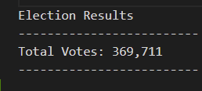
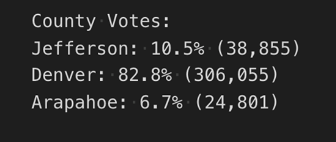
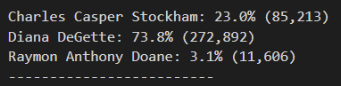
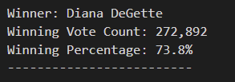

# Election-Analysis

## Project Overview
a We were given the task to calculate the election results for a U.S.
Congressional precinct in the state of Colorado.  We wanted to see the
total number of votes cast, total number of votes for each candidate,
the percentage of votes for each candidate and to see who our winner 
would be.  

## Election Audit Results

- How many vote were cast? Using Python we were able to calcuate the total
- number of votes cast as 369,711 as seen by the imagage below.

* What was the breakdown of number of votes and the percentage of total votes
* for each county?  As you can see by the image below most of our votes
* came from the county of Denver, 82.8% of the vote to be exact.  This
* of course is due to the larger population being in the counnty of
* Denver.

+Which county had the largest number of votes?  Denver county not only
+had the highest percentage but the most total voters.  The number of
+voters that came out were 306,055.  This is also shown in the image
+above.

-Breakdown of the number of votes each candidate received.  As we
show in the image below, our winner, Diana DeGette received 73.8% of the 
vote, then Charles Casper Stockham with 23% of the vote and our last 
candidate received 3.1% of the vote.  

+Who was our winner?  By a wide margin it was Diana DeGette with 
272,892 votes counted for her.

## Election-Audit Summary

As you can see we were able to create a code here using Python to
count all the votes for the candidate but also break down specific 
items that may be needed in the future such as seeing the counts
per county to see how that voter turnout happened.  

The code itself is easily adjusted for number of candidates and
updating the counties we may be tabulating.  This could even work
in a smaller county/city election with wards and such that could
be factored in instead of specific counties.  
 
